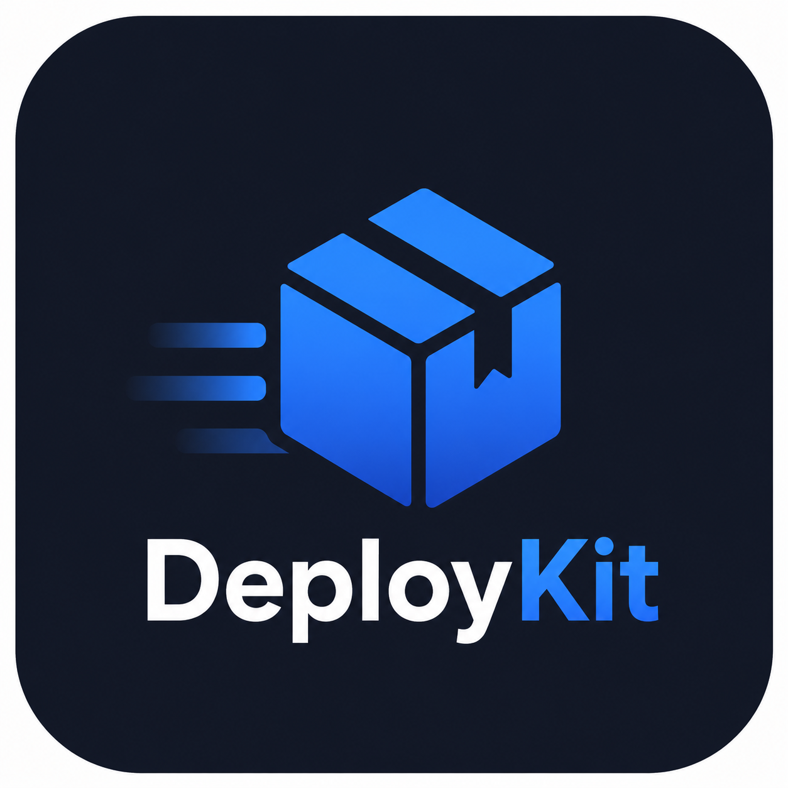

<div align="center">



# deploykit

**Automate CI/CD for Turbo & Nx monorepos deploying to Fly.io.**

Run one command in your monorepo and get a reviewable PR that wires up PR previews, staging, and production — as files you own.

[](https://www.npmjs.com/package/@alminabrulic/deploykit)
[](LICENSE)
[](package.json)
[](https://www.typescriptlang.org/)

</div>

---

deploykit reads your workspace graph, figures out which apps are deployable, and generates the Dockerfiles, `fly.toml` files, and a GitHub Actions workflow — all landed as files you own and can edit. There is **no runtime, no backend, and no lock-in**: once the files are in your repo, deploykit is optional.

- **PR preview environments** — every pull request gets its own deployed app, with the URL commented on the PR and torn down automatically when the PR closes.
- **Staging** — deploys on merge to `main`.
- **Production** — deploys behind a manual approval gate (GitHub Environment protection).

## Contents

- [Requirements](#requirements)
- [Quick start](#quick-start)
- [How it works](#how-it-works)
- [Commands & flags](#commands--flags)
- [What it generates](#what-it-generates)
- [The config file](#the-config-file)
- [Environments](#environments)
- [Secrets & environment variables](#secrets--environment-variables)
- [Health checks & automatic rollback](#health-checks--automatic-rollback)
- [Rolling back a release](#rolling-back-a-release)
- [Multiple regions](#multiple-regions)
- [Custom domains (Cloudflare)](#custom-domains-cloudflare)
- [Database migrations](#database-migrations)
- [Provisioning & opening a PR](#provisioning--opening-a-pr)
- [Framework & monorepo support](#framework--monorepo-support)
- [Security & privacy](#security--privacy)
- [Development](#development)
- [License](#license)

## Requirements

| Need | For |
|------|-----|
| A **git repository** | deploykit opens a PR with the generated files. |
| A **Turbo** (`turbo.json`) or **Nx** (`nx.json`) monorepo | The workspace deploykit reads and deploys. |
| **Node.js ≥ 20** | Running the CLI. |
| [`gh`](https://cli.github.com/) — authenticated | Only for `--pr` and `--provision` (opening the PR, setting Actions secrets). |
| [`flyctl`](https://fly.io/docs/flyctl/install/) — authenticated | Only for `--provision` / `--deploy` and `deploykit rollback`. |
| `CLOUDFLARE_API_TOKEN` | Only if you wire custom domains through Cloudflare. |

Detection, planning, and file generation work with **none** of the CLIs signed in — you only need `gh`/`flyctl` when you opt into provisioning, a PR, or a deploy.

## Quick start

```bash
npx @alminabrulic/deploykit init
```

Prefer a global install (gives you the shorter `deploykit` command used throughout these docs)?

```bash
npm i -g @alminabrulic/deploykit
deploykit init
```

`init` is interactive: it detects everything it can, asks a handful of questions (each pre-filled from detection), shows you the exact plan, and does nothing until you confirm.

### Non-interactive

```bash
# Accept every detected default, print the plan, write nothing:
deploykit init --yes --org my-org --region iad --dry-run

# Write the files for just preview + staging:
deploykit init --yes --org my-org --envs preview,staging

# The full deal: provision Fly apps + secrets and open a PR:
deploykit init --yes --org my-org --region iad --provision --pr
```

## How it works

`deploykit init` runs five phases, and **nothing is written or provisioned until you confirm the plan**:

1. **Preflight** — verifies you're in a git repo with a Turbo or Nx monorepo, and checks whether `gh` / `flyctl` are available and authenticated.
2. **Detect** — reads your package manager, workspace packages, each app's framework, ports, internal dependencies, Prisma schemas, and the env-var names it references.
3. **Ask** — a few questions, each pre-filled from detection: which apps, which environments, Fly org and region(s).
4. **Plan** — shows exactly which files will be written (new / unchanged / **overwrite** if you hand-edited one) and what will be provisioned.
5. **Emit** — writes the files and, if you opted in, provisions Fly apps, sets GitHub secrets, opens a PR, and/or deploys staging.

## Commands & flags

```
deploykit init [options]      Detect the monorepo and set everything up
deploykit generate [options]  Regenerate Dockerfiles/workflow/fly.toml from
                              deploykit.config.ts (overwrites them)
deploykit rollback [options]  Redeploy a prior image for one environment's Fly app
```

- **`init`** — the full detect → ask → plan → emit flow above. Run it once to set up, or again any time (it's re-runnable and never silently clobbers your edits).
- **`generate`** — reads [`deploykit.config.ts`](#the-config-file) and re-emits every Dockerfile, `fly.toml`, and the workflow from it. Use it after you edit the config by hand. Pass `--force` to overwrite files you've since customized.
- **`rollback`** — see [Rolling back a release](#rolling-back-a-release).

| Flag | Applies to | Description |
|------|-----------|-------------|
| `-y`, `--yes` | init, generate | Accept detected defaults, no prompts. |
| `--org <slug>` | init | Fly organization slug. |
| `--region <list>` | init | Fly region(s), comma-separated. The first is the **primary**; any others are extra [stateless regions](#multiple-regions) (e.g. `iad,lhr,fra`). Default: `iad`. |
| `--envs <list>` | init | Environments to configure: `preview,staging,production` (default: all). |
| `--dry-run` | init | Detect and print the plan, but write nothing. |
| `--provision` | init | Create Fly apps, set the `FLY_API_TOKEN` secret, and create GitHub environments (each step confirmed). Forces provisioning in `--yes` mode; interactive runs offer it inline. |
| `--deploy` | init | Deploy the staging app(s) to Fly at the end of the run. |
| `--pr` | init | Commit the generated files on a branch and open a PR. |
| `--force` | init, generate | Overwrite existing generated files instead of skipping them. |
| `--cwd <dir>` | all | Run against a different directory. |
| `--app <name>` | rollback | App to roll back (defaults to the sole app). |
| `--env <kind>` | rollback | Environment: `staging` or `production`. |
| `--to <version>` | rollback | Release version to redeploy (non-interactive). |
| `-h`, `--help` | — | Show help. |
| `-v`, `--version` | — | Show version. |

## What it generates

```
deploykit.config.ts             source of truth — every other file regenerates from this
.dockerignore                   repo-root; keeps secrets & junk out of the build context
.github/workflows/deploy.yml    changes → preview / teardown / staging / production jobs
apps/<app>/Dockerfile           multi-stage, turbo-prune (or nx build) based
apps/<app>/fly.toml             per-app Fly config with a health check
```

> **See it for real:** the [`examples/`](examples/) directory contains the **actual, byte-for-byte output** deploykit produces for a two-app Turbo monorepo (a React Router SSR `web` app with Prisma + a custom domain + multi-region, and a static Astro `marketing` app). Every file there is generated from a single [`examples/deploykit.config.ts`](examples/deploykit.config.ts).

Every file carries a `# Generated by deploykit` header and is **yours to edit and commit**. Re-running `init` or `generate` skips files you've changed unless you pass `--force`, so a hand-edited Dockerfile is never overwritten by surprise.

## The config file

`deploykit.config.ts` is the single source of truth. It's a typed TypeScript file, but its payload is a JSON-style object literal so `deploykit generate` can read it back and regenerate everything. Edit it, then run `deploykit generate`.

```ts
import { defineConfig } from "@alminabrulic/deploykit";

export default defineConfig({
  "tool": "turbo",
  "packageManager": "pnpm",
  "nodeVersion": "20",
  "namePrefix": "acme",              // prefixes every global Fly app name → acme-web-staging
  "provider": {
    "type": "fly",
    "org": "acme",
    "region": "iad",
    "regions": ["iad", "lhr"]        // extra stateless regions (optional)
  },
  "apps": {
    "web": {
      "root": "apps/web",
      "packageName": "@acme/web",
      "framework": "react-router",
      "serve": "server",
      "port": 3000,
      "healthCheckPath": "/",
      "internalDeps": ["@acme/ui", "@acme/database"],
      "secrets": ["DATABASE_URL", "SESSION_SECRET"],   // runtime env vars
      "buildEnv": ["VITE_API_URL"],                    // baked in at build time
      "environments": {
        "preview":    { "name": "web-pr-{pr}", "trigger": "pr" },
        "staging":    { "name": "web-staging", "trigger": "push:main" },
        "production": { "name": "web-prod", "trigger": "manual", "hostname": "shop.example.com" }
      }
    }
    // ... more apps
  }
});
```

The full file — including the Prisma target, the `marketing` app, and the Cloudflare block — is at [`examples/deploykit.config.ts`](examples/deploykit.config.ts). Keep it JSON-style (double-quoted keys, no expressions); `//` and `/* */` comments and trailing commas are fine.

## Environments

deploykit models three environments; you choose which with `--envs`.

| Environment | Trigger | Fly app name | Lifecycle |
|-------------|---------|-------------|-----------|
| **preview** | every pull request | `…-<app>-pr-<number>` | Created/updated on each push; **URL commented on the PR** (one comment, updated in place); **destroyed when the PR closes**. Single machine, single region. |
| **staging** | push to `main` | `…-<app>-staging` | Deployed automatically. Uses the GitHub `staging` environment. |
| **production** | manual (`workflow_dispatch`) | `…-<app>-prod` | Deployed only when you dispatch the workflow; gated by the GitHub `production` environment (add required reviewers there for an approval gate). Runs HA (two machines). |

Only the apps whose files actually changed get deployed on a given run — the workflow's `changes` job uses [`dorny/paths-filter`](https://github.com/dorny/paths-filter) against each app's own directory plus its internal dependencies' directories.

The generated workflow: [`examples/.github/workflows/deploy.yml`](examples/.github/workflows/deploy.yml).

## Secrets & environment variables

deploykit detects the env-var **names** your apps reference (never values) and wires them through GitHub Actions secrets. It distinguishes two kinds:

- **Runtime secrets** (`secrets`) — set on the Fly app via `flyctl secrets set` at deploy time (e.g. `DATABASE_URL`, `SESSION_SECRET`). Read by the running process.
- **Build-time vars** (`buildEnv`) — baked into the bundle during `docker build` via `--build-arg` + Dockerfile `ARG`/`ENV`. These are client-exposed prefixes (`NEXT_PUBLIC_`, `VITE_`, …) and every var of a static app (which has no runtime to read env from).

You add the values once as **repository secrets** in GitHub (`Settings → Secrets and variables → Actions`); the workflow references them by name. Values containing quotes or `$` are passed through shell variables, never interpolated into the script — so they can't break or inject into the deploy step.

## Health checks & automatic rollback

Every generated `fly.toml` includes an HTTP health check:

```toml
[[http_service.checks]]
  method = "GET"
  path = "/"
  interval = "15s"
  timeout = "5s"
  grace_period = "10s"
```

Fly waits for this check to pass before shifting traffic to a new release, and **keeps the old machines running if it fails** — so a bad deploy rolls itself back. If your app's `/` returns a 404 (e.g. an API with no root route), set `healthCheckPath` for that app in `deploykit.config.ts` to a lightweight endpoint like `/health`, or the deploy would wedge.

## Rolling back a release

When a release deployed cleanly but turned out bad, redeploy a previous image:

```bash
deploykit rollback --app web --env production
```

It lists that environment's Fly releases, lets you pick one, shows the exact `flyctl deploy --image …` it will run, and asks before doing it. Script it with `--to <version> --yes`:

```bash
deploykit rollback --app web --env production --to 41 --yes
```

> ⚠️ This rolls back the **app image only** — it does **not** undo database migrations. An older image may not run against a schema a newer release migrated, so prefer additive (expand/contract) migrations.

## Multiple regions

Pass more than one region and the extras become **stateless** regions the app is scaled into after each staging/production deploy (previews stay single-region):

```bash
deploykit init --region iad,lhr,fra      # primary iad, plus lhr and fra
```

You can also set `regions` under `provider` in `deploykit.config.ts`. Each extra region gets one machine via `flyctl scale count 1 --region <r>` after the deploy (best-effort — a transient scale failure warns but doesn't fail an already-successful deploy).

> This is for **stateless** apps. deploykit does not model database locality, so a far-region machine still talks to whatever single-region `DATABASE_URL` you set — expect high write latency. Read replicas / `fly-replay` are out of scope.

## Custom domains (Cloudflare)

Set a `hostname` on a staging/production environment and add a `cloudflare` block to the config, and deploykit issues a Fly certificate and wires the Cloudflare DNS records for you (previews stay on `*.fly.dev`). The Cloudflare block controls proxying, SSL mode, minimum TLS, an "Always Use HTTPS" edge redirect, a security baseline, and static-asset cache rules:

```ts
"cloudflare": {
  "zone": "example.com",
  "proxied": true,
  "ssl": "strict",
  "alwaysUseHttps": true,
  "minTlsVersion": "1.2",
  "security": true,
  "cache": true
}
```

This is entirely optional — omit it and deploykit leaves DNS alone. The Cloudflare token stays in the git-ignored `.deploykit/credentials` file (mode `0600`) or the `CLOUDFLARE_API_TOKEN` env var, and is never committed.

## Database migrations

deploykit does **not** run migrations — a bad one causes irreversible data loss, and owning that is out of scope. Instead, when it detects a Prisma schema in an app it writes a **commented-out** hook into that app's `fly.toml`:

```toml
# [deploy]
#   release_command = "(cd packages/database && npx prisma migrate deploy --schema ./prisma/schema.prisma)"
```

`[deploy].release_command` is Fly's idiomatic migration hook: it runs once per release, before new machines take traffic. Uncomment it only against a database you own, and make sure the Prisma CLI and schema are present in your runtime image. Note that `deploykit rollback` reverts the **image only** — it does not undo a migration this hook applied, so prefer additive (expand/contract) migrations. Using another tool (Drizzle, Knex, …)? Uncomment and swap the command for its migrate step.

deploykit does handle Prisma **client generation** for you: it isn't generated on install under pnpm 10 / Prisma 7, so the Dockerfile runs `prisma generate` for every Prisma package in an app's dependency closure before the build.

## Provisioning & opening a PR

By default `init` only writes files. Opt into the side effects:

- **`--provision`** — for each environment's app: `flyctl apps create` (if missing), set the `FLY_API_TOKEN` repository secret, and create the GitHub `staging`/`production` environments. Each step is confirmed; in interactive mode it's offered inline.
- **`--pr`** — commit the generated files on a `deploykit/setup` branch and open a pull request. Re-runnable: it reuses the branch and an existing open PR, and skips committing when nothing changed.
- **`--deploy`** — after generating (and provisioning), deploy the staging app(s) to Fly directly, so you can see it live without waiting for a merge.

## Framework & monorepo support

**Monorepo tools**

- **Turbo** — full support via `turbo prune` multi-stage Docker builds.
- **Nx** — supported via `nx build` + `dist/<projectRoot>` output. Node-server and static (Vite/Astro) apps are solid; Next/SSR Dockerfiles follow Nx conventions but are worth a glance before your first deploy.

**App types** — the runner is chosen per app from a `serve` model, not hardcoded per framework:

- **Server** apps (Next, Remix, React Router, Astro-node, or any `node-server`) run their long-running process. The CMD is package-manager-free so it works in the slim runtime image.
- **Static** apps (Vite, Astro static, plain static) are served with `serve` (SPA history fallback available via `spa`).

**Deploy target** — Fly.io.

**Not in scope (v1)** — deploykit provisions **no database** (it detects Prisma and writes the opt-in, commented migration hook above; the database itself is yours to create and own), and does not model stateful multi-region.

## Security & privacy

deploykit is a **local CLI with no backend** — it never sends your credentials anywhere except directly to GitHub, Fly, and Cloudflare to do the work you ask for, and it collects **no telemetry**.

- **GitHub** sign-in uses the OAuth device flow; the token is stored by the official `gh` CLI (your OS keychain or `~/.config/gh/hosts.yml`) — deploykit keeps no copy.
- **Fly** is handled by `flyctl`; the CI deploy token is written only as your repo's `FLY_API_TOKEN` GitHub Actions secret.
- **Cloudflare** tokens (optional) stay in the git-ignored `.deploykit/credentials` file (mode `0600`) or an env var — never committed.

You can verify all of this: the code is source-available (see [`src/auth.ts`](src/auth.ts) and [`src/secrets-file.ts`](src/secrets-file.ts)), and releases ship with npm provenance. Full details, exactly what each provider accesses, and revocation steps are in **[SECURITY.md](SECURITY.md)**.

To report a vulnerability, please use [GitHub's private vulnerability reporting](https://github.com/abrulic/deploykit/security/advisories/new) rather than a public issue.

## Development

```bash
pnpm install
pnpm dev -- init --dry-run    # run the CLI from source (tsx)
pnpm build                    # bundle to dist/ (tsup)
pnpm test                     # vitest
pnpm typecheck                # tsc --noEmit
pnpm lint                     # biome check
```

The generated config is the source of truth: every Dockerfile, `fly.toml`, and workflow is regenerable from `deploykit.config.ts`. When you change generation logic, add a Vitest test covering the output (generated shell/YAML must stay safe against injection from repo-derived values). See [REVIEW.md](REVIEW.md) for the review guidelines.

## Documentation

Full documentation lives in [`docs/`](docs/) — a self-contained docs site
(React Router v7 + content-collections, built from the
[code-forge docs template](https://github.com/code-forge-io/docs)). The content
is under [`docs/content/`](docs/content/). To run it locally:

```bash
cd docs
pnpm install
pnpm run dev
```

## License

deploykit is **source-available** under the [Business Source License 1.1](LICENSE) (`BUSL-1.1`).

- ✅ Free to read, modify, self-host, and use for **non-production** and **non-commercial production** purposes.
- 💳 Using deploykit in production **for a commercial purpose** (building, deploying, or operating software that is sold or offered as a paid service) requires a **commercial license** — [get in touch](mailto:contact@alminabrulic.com).
- 🔓 Each released version automatically converts to the **Apache License 2.0** four years after its release (its Change Date).

See [LICENSE](LICENSE) for the full terms.
