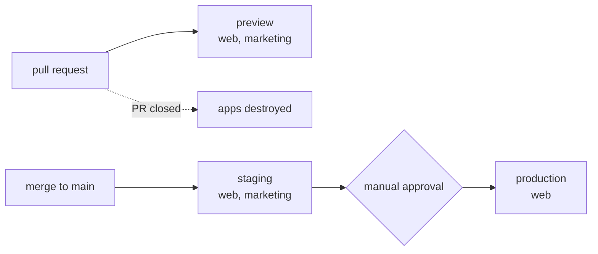

# Deployments

<!-- Generated by deploykit. Edit `deploykit.config.ts` and run `deploykit generate`
     to update this file — hand edits are overwritten. -->

Where every app runs, what deploys it, and where to click in each dashboard.

## web — `apps/web`

| Environment | URL | Fly app | Deploys | Dashboards |
| --- | --- | --- | --- | --- |
| preview | `https://acme-web-pr-{pr}.fly.dev` | `acme-web-pr-{pr}` | on every pull request | created per PR |
| staging | <https://acme-web-staging.fly.dev> | `acme-web-staging` | on merge to main | [app](https://fly.io/apps/acme-web-staging) · [logs](https://fly.io/apps/acme-web-staging/monitoring) · [secrets](https://fly.io/apps/acme-web-staging/secrets) |
| production | <https://shop.example.com> | `acme-web-prod` | manual approval | [app](https://fly.io/apps/acme-web-prod) · [logs](https://fly.io/apps/acme-web-prod/monitoring) · [secrets](https://fly.io/apps/acme-web-prod/secrets) |

## marketing — `apps/marketing`

| Environment | URL | Fly app | Deploys | Dashboards |
| --- | --- | --- | --- | --- |
| preview | `https://acme-marketing-pr-{pr}.fly.dev` | `acme-marketing-pr-{pr}` | on every pull request | created per PR |
| staging | <https://acme-marketing-staging.fly.dev> | `acme-marketing-staging` | on merge to main | [app](https://fly.io/apps/acme-marketing-staging) · [logs](https://fly.io/apps/acme-marketing-staging/monitoring) · [secrets](https://fly.io/apps/acme-marketing-staging/secrets) |

## Where to look

| If you need to… | Go to |
| --- | --- |
| Approve a production deploy (or add reviewers) | GitHub → Settings → Environments |
| Rotate `FLY_API_TOKEN` | [Fly org tokens](https://fly.io/dashboard/acme/tokens) |
| Fix DNS or a certificate for example.com | [DNS](https://dash.cloudflare.com/?to=/:account/example.com/dns) · [SSL/TLS](https://dash.cloudflare.com/?to=/:account/example.com/ssl-tls) |
| Find an app not listed above (a live PR preview, say) | [Fly dashboard](https://fly.io/dashboard/acme) |

_No GitHub remote was found when this file was generated, so the GitHub links are omitted. Re-run `deploykit generate` once the remote is set._

## Secrets

Values live in GitHub Actions secrets and are never stored in this repo. Set or update them with `deploykit init`, or in the GitHub UI.

| Name | Wired as | Used by |
| --- | --- | --- |
| `DATABASE_URL` | runtime — `flyctl secrets set` | web |
| `SESSION_SECRET` | runtime — `flyctl secrets set` | web |
| `VITE_API_URL` | build-time — baked into the image (`--build-arg`) | web |

Per-environment values (a staging vs production `DATABASE_URL`) go on the matching GitHub environment; anything set at the repository level applies to every environment that doesn't override it.

## Good to know

- **Preview apps don't exist until a PR opens.** The workflow creates them on first deploy and destroys them when the PR closes, so you won't find them on the Fly dashboard in between.
- **Production waits for a human.** It only deploys after the `production` GitHub environment is approved — add required reviewers there, or the gate approves itself.
- **Custom domains resolve through Cloudflare.** DNS records point at Fly and the certificate is issued by Fly; the `*.fly.dev` address keeps working either way, which makes it the thing to test against when a domain looks wrong.
- **A failed health check keeps the old release serving.** Fly only shifts traffic once the new machines pass their check, so a bad deploy stalls instead of taking the app down. To undo a release that passed but misbehaves, run `deploykit rollback`.
- **Everything here is regenerable.** `deploykit.config.ts` is the source of truth — edit it and run `deploykit generate` to update the Dockerfiles, `fly.toml` files, the workflow, and this file.
